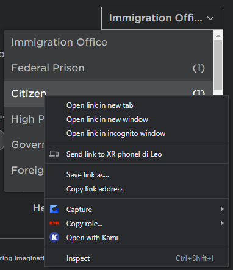
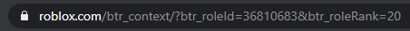
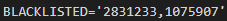

# Immigration Bot
A simple bot that can be used to automatically rank users in your group upon join.

**THIS DOES REQUIRE NODE.JS! [https://nodejs.org/en/](https://nodejs.org/en/)**

## Setup

Most of this is a normal thing, but there are some other parts that the average ROBLOXian may not know about this.
All of the config is in the `.env` file.

### TOKEN
This is the discord token of the bot. To get this, please go to [https://discord.com/developers/applications](https://discord.com/developers/applications) and make an application, activate the bot account, and put its token in this field.

### COOKIE
This is the cookie of the ROBLOX account you want to link your bot to. This account needs to have ranking permissions to the group you want to set this bot up for. **I DO NOT RECOMMEND USING YOUR MAIN ACCOUNT.**

### GROUPID, CITIZENROLE, DETAINROLE
Pretty self explanatory. The group ID is, well, the group ID, citizen role is for those who are in no blacklisted groups, and detain role is for those caught in blacklisted groups.

### IMMIGRATIONRANK
Well, this is one of the tougher parts. In ROBLOX, ranks have a role ID and a rank ID. This one requires the ROLE ID. To get this, right click your rank as shown and open in a new tab:

You will be then led to a 404 page. Do not fret, as the role ID is right up there for you! It should be the ID with 6-8 digits.

### BLACKLISTED
This is a list of blacklisted groups. Seperate the group IDs with commas, like this:

### PREFIX
This may be an immigration bot that should have no commands, but no, it does! This is the prefix of those commands.

### LOGCHANNEL
This is the channel ID of where you would like to log your immigrants.

## Turning it on
Make sure that the .env file is how you want it to be. Then you can do the following in the directory:
  1. `npm i`
  2. `npm start`

## Commands
There is only two commands, but they serve a purpose in the bot. `(prefix)immigration` serves the purpose of choosing to open or close the border. You can use `(prefix)immigration on|true|enable` to open the borders and `(prefix)immigration off|false|disable` to close the borders.
The other command is `(prefix)check (username)`. This allows you to send a user back to immigration to ensure that they are not in any blacklisted groups.

## Hosting
Ah, the topic of hosting. There are many ways to go about this, but I recommend using repl.it. I will teach you how to do this in this section.
  1. Go to [https://repl.it](https://repl.it).
  2. Make an account if you don't already have one. Then proceed to making a new repl BUT DO NOT HIT THE CREATE BUTTON.
  3. Hit the "Import from GitHub" tab and type in `justIeo/immigration-bot`. The repl will be created with the base bot.
  4. Configure the .env file to your liking.
  5. Hit the "Run" button and head to [https://uptimerobot.com](https://uptimerobot.com). Make an account or log in if you have one.
  6. Make a new HTTPS monitor with the URL of `project-name.repl-username.repl.co`.
  7. It should be up and running and it should go 24/7.
